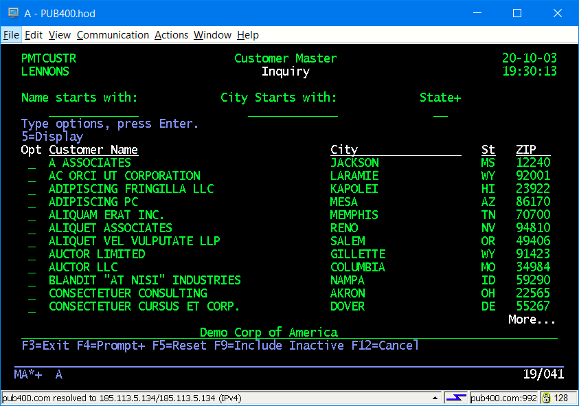
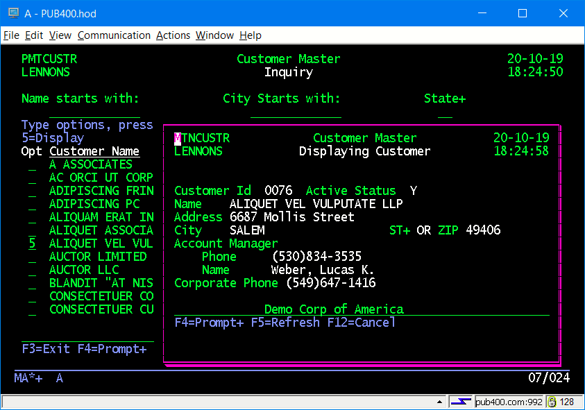

## 5250 Subfile: Full Screen and Windows

(__Under Construction__)

This is a working application that allows display, selection and maintenance of a customer master. The screens are _similar_ to what you see in PDM. The code is modular and there are several programs that can be called from multiple places.  SQL is used for all database IO. There are full screen subfiles and subfiles in a window.

### Sample Inquiry Screens

### Sample Maintenance Screen

#### PMTCUSTR/PMTCUSTD 

 RPG program that puts up a 5250 subfile that allows searching by customer name, city and state. Display of Inactive records can be toggled using F9.
    
 There are 3 functions, or modes, controlled by the first parameter passsed:  Inquiry to display a record; Maintenance to change a record;, Selection to return a customer id.

        - I gives 5=Display
        - M gives 2=Edit 5=Display
        - S gives 1=select 5=Display
  Conceptually, you can call this program from almost anywhere and access to it is contolled by whatever menuing or security system you have in place. The general user population would progably get Inquiry and Sales would have Maintenance. Selection could be used for any in-house program that needed to prompt for  a customer id number.
  
#### MTNCUSTR/MTNCUSTD

  RPG program that maintains a customer.  Customer id is provided as the first parameter. It also adds or displays a customer. Function is controlled by the second parameter. It is called from PMTCUSTR, but it could be called from any program that has a customer id available, or needs to add a customer.

#### CRTMSGF

  Creates the CUSTMSGF message file used by the programs.

#### CRTDTAARA
  
  Create the CUSTNEXT data area that contains the next available customer id.

#### CustMast.SQL

  SQL code to create and populate the CUSTMAST tsble. You will need to change the _**set schema**_ in the first line to your target library.  You would put this file in the IFS and run it with the RUNSQLSTM command.

  Contains 300 randomly generate rows, courtesy of the fine folk at _http://generatedata.com/_, plus a little tweaking by hand.   